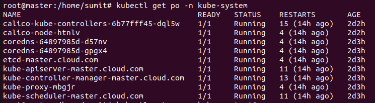
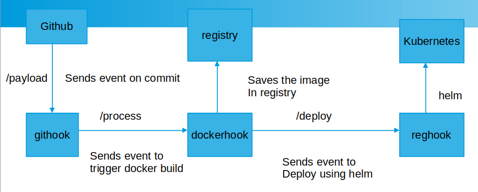

# kubernetes

Installation of kubernetes cluster in private cloud using kubeadm.

## Configuration

The following table lists the configurable parameters of the kubernetes cluster install and their default values.

| Parameter                   | Description                                                                                                                                                                                  | Default                               |
|-----------------------------|----------------------------------------------------------------------------------------------------------------------------------------------------------------------------------------------|---------------------------------------|
| `CLUSTER_NAME`              | Kubernetes cluster name                                                                                                                                                                      | `cloud.com`                           |
| `MOUNT_PATH`                | The mount path where kubernetes scripts and certificates are available.                                                                                                                      | `/root`                               |
| `DNS_DOMAIN`                | The domains where vms are hosted.                                                                                                                                                            | `cloud.uat`                           |
| `CERTIFICATE_PATH`          | The path where certificates are present.                                                                                                                                                     | `/etc/kubernetes/pki`                 |
| `SERVER_DNS`                | The comma separated dns names where kubernetes master would be running, this also includes name of the kubernetes api service dns names, the dns name where ha proxy is running              | `master.cloud.com..`                  |
| `SERVER_IP`                 | The comma separated list of all the ip addresses where master and ha proxy would be running (actual & virtual). This should also include the ip addess of kubernetes cluster api service ip. | `11.0.0.1,..`                         |
| `HA_PROXY_PORT`             | Port of HA Proxy.                                                                                                                                                                            | `6443`                                |
| `HA_PROXY_HOSTNAME`         | IP/Hostname where HA Proxy running.                                                                                                                                                          | `11.0.0.1`                            |
| `LOAD_BALANCER_URL`         | Endpoint of HA Proxy.                                                                                                                                                                        | `11.0.0.1:6443`                       |
| `APP_HOST`                  | Hostname that would be put in ingress.                                                                                                                                                       | `master.cloud.com`                    |
| `API_SERVERS`               | List of api servers which are used in creating certificates for ha proxy.                                                                                                                    | `11.0.0.1:master.clud.com,..`         |
| `OIDC_ISSUE_URL`            | OpenID Connect issuer url.                                                                                                                                                                   | `https://skmaji.auth0.com/`           |
| `OIDC_CLIENT_ID`            | OpenID Connect Application ID.                                                                                                                                                               | `Client ID`                           |
| `OIDC_USERNAME_CLAIM`       | Field name in the ID Token for username claim.                                                                                                                                               | `sub`                                 |
| `OIDC_GROUPS_CLAIM`         | Field name in the ID Token for group claim.                                                                                                                                                  | `http://localhost:8080/claims/groups` |


# Installation steps:

- Install Cluster in Digital Ocean

```console
cd /root/kubernetes/install_cluster
./install_master_node.sh -e CLOUD
```

- Install Cluster in Local Ubuntu Cluster

```shell
cd /root/kubernetes/install_cluster
./install_master_node.sh -e LOCAL
```

- Install kubernetes:

  - Master:

  ```shell
  cd /root/kubernetes/install_k8s
  ./gok install kubernetes
  ```

  - Worker:

  ```shell
  cd /root/kubernetes/install_k8s
  ./gok install kubernetes-worker
  ```

  - To join a worker node:
  
  ```shell
  join
  ```

  - To remove a kubernetes setup:
  
  ```shell script
  ./gok reset kubernetes
  ```
  
  - To create a new join token
  
  ```shell script
  kubeadm token create print-join-command
  ```
  
When installation of master is completed you should see below components in kube-system
namespace


When you reboot the vms, the kubelet service may not run, you need to restart the kubelet.

```shell
sudo sed -i '/ swap / s/^\(.*\)$/#\1/g' /etc/fstab
sudo swapoff -a

systemctl stop kubelet
syatemctl start kubelet
```

Or Execute below command

```shell
./gok start proxy
```
### Other debugging steps

```shell
systemctl status kubelet
journalctl -u kubelet
```

# Useful commands:

- To change namespace

```shell
kcd name_space
```

- Inorder to login via OpenId Connect username/password

```console
alias kctl='kubectl --kubeconfig=/root/oauth.conf --token=$(python3 /root/kubernetes/install_k8s/kube-login/cli-auth.py)'
```

In order to use the above approach, you must install and run
1. Ingress [Instress ReadME](install_k8s/ingress/README.md)
2. Kubeauthentication service [KubeAuth ReadME](https://github.com/sumitmaji/kubeauthentication/blob/main/README.md)


- To enable verbose(logging) of kubectl command

```console
kubectl get pods --v 6
```

# Useful commands

```console
kubectl top nodes --v 6
```
```console
kubectl get pod, svc, hpa -owide
watch -n1 !!
```
```console
kubectl get componentstatus
```

# Automation of build and deployment
### Note: [`Ingress`](install_k8s/ingress) should be installed before this can begin.

- Execute below command to install ci/cd pipeline
```console
cd /root/kubernetes/install_k8s/
./setuUp-devops.sh 
```
This would install local [`docker registry`](install_k8s/registry),
[`Git webhook`](install_k8s/githook), 
[`Docker webhook`](install_k8s/dockerhook)
and [`Helm webhook`](install_k8s/reghook)

Architecture of the pipeline


In order to test the pipeline use [`hlw`](https://github.com/sumitmaji/hlw) repository, make a sample change and commit.

Application would be accessible in https://master.cloud.com:32028/hlw


# Installing components
1. [`Ingress Controller`](install_k8s/ingress/README.md)
2. [`Cert Manager`](install_k8s/cert-manager/README.md)
3. [`Keycloak`](install_k8s/keycloak/README.md)
4. [`Kube Login Webhook`](https://github.com/sumitmaji/kubernetes/tree/master/install_k8s/kube-login)
5. [`Devops`](https://github.com/sumitmaji/kubernetes/blob/master/install_k8s/setUp-Devops.sh): [`Githook`](https://github.com/sumitmaji/kubernetes/tree/master/install_k8s/githook),
    [`Dockerhook`](https://github.com/sumitmaji/kubernetes/tree/master/install_k8s/dockerhook),[`Reghook`](https://github.com/sumitmaji/kubernetes/tree/master/install_k8s/reghook)
6. [`Kubernetes Dashboard`](install_k8s/dashboard)
7. [`Kube Authentication`](https://github.com/sumitmaji/kubeauthentication)
8. [`Ldap`](https://github.com/sumitmaji/kubernetes/blob/master/install_k8s/ldap/run_ldap.sh): [`Link`](https://github.com/sumitmaji/kubernetes/tree/master/install_k8s/ldap)
9. [`Kerberos`](https://github.com/sumitmaji/kubernetes/blob/master/install_k8s/kerberos/run_kerberos.sh): [`Link`](https://github.com/sumitmaji/kubernetes/tree/master/install_k8s/kerberos)
10. [`Ldap Client`](https://github.com/sumitmaji/kubernetes/blob/master/install_k8s/ldapclient/run_ldapclient.sh): [`Link`](https://github.com/sumitmaji/kubernetes/tree/master/install_k8s/ldapclient1)
11. [`Ldap Client2`](https://github.com/sumitmaji/kubernetes/blob/master/install_k8s/ldapclient2/run_ldapclient2.sh): [`Link`](https://github.com/sumitmaji/kubernetes/tree/master/install_k8s/ldapclient2)
12. [`Spinnaer`](install_k8s/spinnaker/README.md)
13. [`Opensearch`](install_k8s/opensearch/README.md)
14. [`Prometheus-Grafana`](install_k8s/prometheus-grafana/README.md)
15. [`Oauth2 Proxy`](install_k8s/oauth2-proxy/README.md)
16. [`Fluentd`](install_k8s/fluentd/README.md)

- Add ca.crt and server.crt file in chrome browser, please refer [link](https://support.globalsign.com/customer/portal/articles/1211541-install-client-digital-certificate---windows-using-chrome) on how to add certificate. Add server.crt in `Other People` tab and ca.crt in `Trusted Root Certificate Authority` tab.
- Add `ip_address master.cloud.com` to windows host file located in C:\Windows\System32\drivers\etc. e.g. `192.168.1.5 master.cloud.com` >> host file.