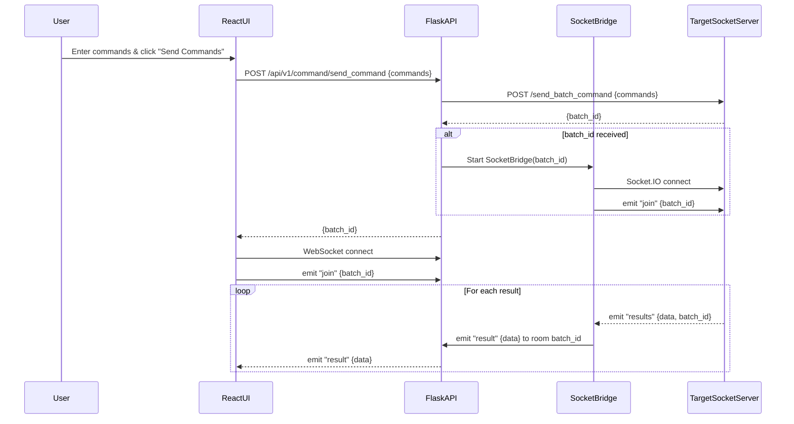

# Backend Documentation

## Overview
This is the backend of the my-fullstack-app project, built using Python and Flask. It serves as the API for the frontend React application.

## Setup Instructions

1. **Clone the Repository**
   ```bash
   git clone https://github.com/yourusername/my-fullstack-app.git
   cd my-fullstack-app/backend
   ```

2. **Create a Virtual Environment**
   It is recommended to use a virtual environment to manage dependencies.
   ```bash
   python3 -m venv venv
   source venv/bin/activate  # On Windows use `venv\Scripts\activate`
   ```

3. **Install Dependencies**
   Install the required packages listed in `requirements.txt`.
   ```bash
   pip install -r requirements.txt
   ```

4. **Run the Application**
   Start the Flask application.
   ```bash
   python app.py
   ```

## Usage
The backend API is accessible at `http://localhost:8080`. You can interact with the various endpoints defined in `app.py`.

## Contributing
If you wish to contribute to this project, please fork the repository and submit a pull request with your changes.

Certainly! Here’s a step-by-step explanation of the flow for `/send_command` and the socket connection in your Flask backend:

---

### 1. **Client Sends Command**
- The React frontend (or any client) sends a POST request to `/api/v1/command/send_command` with a JSON body like:
  ```json
  { "commands": ["ls -l", "whoami"] }
  ```

---

### 2. **Flask Route Handles the Request**
- The `send_command` route in command.py receives the request.
- It validates that `commands` is a list of strings.

---

### 3. **Forward to Target Server**
- The backend makes a POST request to the **target server’s** `/send_batch_command` endpoint, forwarding the commands and the user's Authorization header.
- Example:
  ```python
  resp = requests.post(
      TARGET_SERVER_API,
      json={"commands": commands},
      headers={"Authorization": request.headers.get("Authorization")}
  )
  ```

---

### 4. **Get `batch_id` from Target Server**
- The target server responds with a JSON containing a `batch_id` that uniquely identifies this command batch.
- If the response is not successful or lacks a `batch_id`, an error is returned to the client.

---

### 5. **Start Socket Bridge**
- If this `batch_id` does not already have a socket bridge, the backend creates a new `SocketBridge` instance.
- The `SocketBridge`:
  - Connects as a Socket.IO client to the **target server’s** socket endpoint.
  - On connect, emits a `"join"` event with the `batch_id` to subscribe to results for this batch.
  - Listens for `"results"` events from the target server.
  - Forwards each `"results"` event as a `"result"` event to all connected React clients in the same `batch_id` room via Flask-SocketIO.

---

### 6. **Client Receives batch_id**
- The backend responds to the original POST with:
  ```json
  { "msg": "Command sent", "batch_id": "<the-batch-id>" }
  ```
- The React client uses this `batch_id` to join the corresponding WebSocket room.

---

### 7. **WebSocket Data Flow**
- The React client connects to the backend’s WebSocket (Flask-SocketIO).
- It emits a `"join"` event with the `batch_id` to join the room.
- Whenever the backend receives a `"results"` event from the target server (via the bridge), it emits a `"result"` event to the React client(s) in that room.
- The React client listens for `"result"` events and updates the UI accordingly.

---

### **Summary Diagram**

```
React Client
   |  (POST /send_command)           Flask Backend
   |----------------------------->   [send_command route]
   |                                 |
   |                                 |--(POST /send_batch_command)--> Target Server
   |                                 |<------------------------------ [batch_id]
   |<-----------------------------   |
   |   { batch_id }                  |
   |                                 |--[SocketBridge connects to Target Server socket]
   |                                 |--[SocketBridge emits "join" with batch_id]
   |                                 |--[SocketBridge listens for "results"]
   |                                 |--[SocketBridge emits "result" to React via WS]
   |<==============================  |
   |   (WebSocket "result" events)   |
```

---

**In summary:**  
- `/send_command` forwards commands to the target server and starts a socket bridge.
- The bridge relays `"results"` from the target server to your React client as `"result"` events via WebSocket, using the `batch_id` as a room key.




This code is part of the `run` method in the `SocketBridge` class. Here’s what it does and its purpose:

---

### **What it does:**

1. **Defines a `connect` event handler** for the Socket.IO client (`self.sio`):
   - When the connection to the target socket server is established, it prints a message and emits a `"join"` event with the `batch_id`.  
   - This subscribes the backend to receive results for that specific batch from the target server.

2. **Defines a `results` event handler**:
   - When the target server emits a `"results"` event (with data for the batch), this handler is called.
   - It prints the received data and then emits a `"result"` event to all frontend clients in the corresponding room (`batch_id`) using Flask-SocketIO (`self.socketio_ws.emit`).

3. **Connects to the target server**:
   - Tries to connect to the target server’s Socket.IO endpoint.
   - Calls `self.sio.wait()` to keep the client running and listening for events.

4. **Error handling**:
   - If there’s an exception during connection or communication, it emits a `"result"` event with the error message to the frontend clients in the room.

---

### **Purpose:**

- **Bridge/Relay:**  
  This method acts as a bridge between the target server’s socket and your frontend clients.  
  It listens for results from the target server and forwards them to the correct frontend clients via WebSocket, using the `batch_id` as a room key.

- **Room-based Routing:**  
  By emitting `"join"` with the `batch_id`, it ensures only the relevant results are received and forwarded to the correct clients.

---

**In summary:**  
This code connects to the target server’s socket, subscribes to results for a specific batch, and relays those results to your frontend clients in real time.