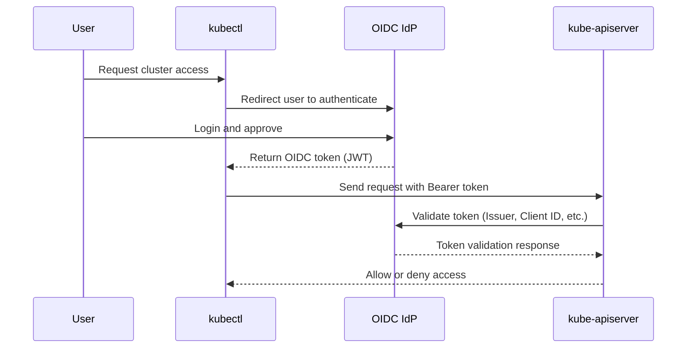

```mermaid
sequenceDiagram
    participant User
    participant kubectl
    participant OIDC IdP
    participant kube-apiserver

    User->>kubectl: Request cluster access
    kubectl->>OIDC IdP: Redirect user to authenticate
    User->>OIDC IdP: Login and approve
    OIDC IdP-->>kubectl: Return OIDC token (JWT)
    kubectl->>kube-apiserver: Send request with Bearer token
    kube-apiserver->>OIDC IdP: Validate token (Issuer, Client ID, etc.)
    OIDC IdP-->>kube-apiserver: Token validation response
    kube-apiserver-->>kubectl: Allow or deny access
```