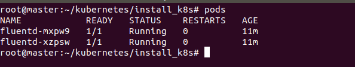

# Fluentd

## Documentation

- [Setup using elastisearch](https://medium.com/kubernetes-tutorials/cluster-level-logging-in-kubernetes-with-fluentd-e59aa2b6093a)
- [Helm Char](https://artifacthub.io/packages/helm/fluent/fluentd)
- [Fluentd setup for Opensearch](https://github.com/fluent/fluentd-kubernetes-daemonset/blob/master/fluentd-daemonset-opensearch.yaml)

## Installation

**Note:** Before installing fluentd make sure that [opensearch](../opensearch/README.md) service has been started.

```shell
./gok install fluentd
```



## Uninstallation

```shell
./gok reset fluentd
```

