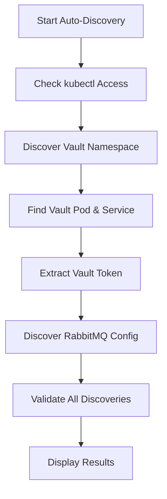

# 🔐 Vault RabbitMQ Setup - Auto-Discovery Version


A **zero-configuration** credential management tool that automatically discovers Vault and RabbitMQ configuration from your Kubernetes cluster and seamlessly migrates credentials for centralized secret management.

## � Quick Start

### Zero-Configuration Migration
```bash
# Complete credential migration - no setup required!
./vault_rabbitmq_setup.sh store-from-k8s
```

### Auto-Discovery Only
```bash
# Discover all configuration without making changes
./vault_rabbitmq_setup.sh discover
```

## 📋 Table of Contents

- [✨ Features](#-features)
- [🔍 Auto-Discovery Capabilities](#-auto-discovery-capabilities)
- [📦 Installation](#-installation)
- [🎯 Usage](#-usage)
- [🛠️ Commands](#️-commands)
- [🔧 Configuration](#-configuration)
- [📊 Examples](#-examples)
- [🐛 Troubleshooting](#-troubleshooting)
- [🤝 Integration](#-integration)

## ✨ Features

### 🔍 **Auto-Discovery Engine**
- **Vault Detection**: Automatically finds Vault namespace, pod, and service IP
- **Token Extraction**: Retrieves Vault tokens from multiple secret sources
- **RabbitMQ Discovery**: Locates RabbitMQ namespaces and credential secrets
- **Smart Fallbacks**: Handles various naming conventions and secret formats

### 🛡️ **Security & Reliability**
- **Zero Hardcoded Credentials**: No secrets stored in scripts or environment
- **Multiple Token Sources**: Supports `vault-init-keys`, custom secrets, and manual tokens
- **Comprehensive Validation**: Validates credentials before and after migration
- **Audit Trail**: Complete metadata tracking for all credential operations

### ⚡ **Operational Excellence**
- **Zero Configuration**: Works out-of-the-box with existing Kubernetes clusters
- **CLI + API Support**: Functions with or without Vault CLI installed
- **Cross-Environment**: Consistent operation across dev/staging/production
- **Detailed Logging**: Comprehensive progress tracking and error diagnostics

## 🔍 Auto-Discovery Capabilities

### **What Gets Auto-Discovered**

| Component | Discovery Method | Fallback Strategy |
|-----------|------------------|-------------------|
| **Vault Namespace** | `kubectl get namespaces` → grep vault | Default: `vault` |
| **Vault Pod** | Label selector + running status check | Manual pod listing |
| **Vault Service IP** | ClusterIP from service discovery | Pod IP extraction |
| **Vault Token** | `vault-init-keys` → JSON extraction | Multiple secret sources |
| **RabbitMQ Namespace** | Namespace enumeration + validation | Default: `rabbitmq` |
| **RabbitMQ Secret** | Pattern matching + credential validation | Secret enumeration |

### **Discovery Process Flow**



## 📦 Installation

### Prerequisites
- **Kubernetes Cluster Access**: `kubectl` configured and authenticated
- **Network Connectivity**: Access to Kubernetes API and Vault service
- **Permissions**: Read access to secrets in Vault and RabbitMQ namespaces

### Optional Components
- **Vault CLI**: Enhanced functionality when available
- **Python 3**: Required for JSON parsing and connection testing
- **curl**: Fallback for Vault API access

### Setup
```bash
# Clone or download the script
curl -O https://your-repo/vault_rabbitmq_setup.sh
chmod +x vault_rabbitmq_setup.sh

# Verify kubectl access
kubectl cluster-info

# Run discovery to validate setup
./vault_rabbitmq_setup.sh discover
```

## 🎯 Usage

### Basic Workflow

#### 1. **Discovery Phase**
```bash
# Discover all configuration
./vault_rabbitmq_setup.sh discover
```

**Expected Output:**
```
[INFO] Auto-discovering Vault configuration from Kubernetes cluster...
[SUCCESS] Found Vault namespace: vault
[SUCCESS] Found Vault pod: vault-0
[SUCCESS] Found Vault service IP: 10.96.136.42
[SUCCESS] Root token discovered from vault-init-keys
[SUCCESS] Found RabbitMQ namespace: rabbitmq
[SUCCESS] Found RabbitMQ secret: rabbitmq-default-user

=== AUTO-DISCOVERY RESULTS ===
Vault Namespace: vault
Vault Pod: vault-0
Vault Address: http://10.96.136.42:8200
Vault Token: [DISCOVERED]
RabbitMQ Namespace: rabbitmq
RabbitMQ Secret: rabbitmq-default-user
Storage Path: secret/rabbitmq
```

#### 2. **Migration Phase**
```bash
# Migrate credentials from Kubernetes to Vault
./vault_rabbitmq_setup.sh store-from-k8s
```

#### 3. **Validation Phase**
```bash
# Test RabbitMQ connectivity using Vault credentials
./vault_rabbitmq_setup.sh test-connection
```

## 🛠️ Commands

### 🚀 **Automated Commands** (Zero Configuration)

#### `discover`
Auto-discovers all Vault and RabbitMQ configuration without making changes.

```bash
./vault_rabbitmq_setup.sh discover
```

**Use Cases:**
- Initial setup validation
- Configuration auditing
- Troubleshooting connectivity issues

#### `store-from-k8s`
Complete automated migration from Kubernetes secrets to Vault.

```bash
./vault_rabbitmq_setup.sh store-from-k8s
```

**Process:**
1. Auto-discovers all configuration
2. Extracts RabbitMQ credentials from Kubernetes
3. Stores credentials in Vault with metadata
4. Validates successful storage

#### `test-connection`
Tests RabbitMQ connectivity using Vault-stored credentials.

```bash
./vault_rabbitmq_setup.sh test-connection
```

**Validates:**
- Vault credential retrieval
- RabbitMQ authentication
- Network connectivity
- End-to-end functionality

#### `status`
Shows complete configuration and system status.

```bash
./vault_rabbitmq_setup.sh status
```

### 🔧 **Manual Commands**

#### `store`
Interactive credential storage for custom credentials.

```bash
./vault_rabbitmq_setup.sh store
```

#### `retrieve`
Retrieves and displays stored credentials from Vault.

```bash
./vault_rabbitmq_setup.sh retrieve
```

#### `rotate`
Generates new passwords and rotates credentials in Vault.

```bash
./vault_rabbitmq_setup.sh rotate
```

## 🔧 Configuration

### Environment Variables

All variables are **optional** due to auto-discovery capabilities:

| Variable | Description | Auto-Discovery | Default |
|----------|-------------|----------------|---------|
| `VAULT_ADDR` | Vault server address | ✅ From service IP | `http://discovered-ip:8200` |
| `VAULT_TOKEN` | Authentication token | ✅ From cluster secrets | From `vault-init-keys` |
| `VAULT_PATH` | Storage path in Vault | ❌ | `secret/rabbitmq` |
| `RABBITMQ_NAMESPACE` | Kubernetes namespace | ✅ From cluster | Auto-discovered |
| `RABBITMQ_SECRET_NAME` | Secret name | ✅ Pattern matching | Auto-discovered |

### Manual Override Examples

```bash
# Use custom Vault path
VAULT_PATH=secret/prod/rabbitmq ./vault_rabbitmq_setup.sh store-from-k8s

# Use specific RabbitMQ namespace
RABBITMQ_NAMESPACE=messaging ./vault_rabbitmq_setup.sh discover

# Use manual Vault token
VAULT_TOKEN=hvs.xyz123... ./vault_rabbitmq_setup.sh test-connection
```

## 📊 Examples

### Example 1: Complete Zero-Config Setup

```bash
# Step 1: Discover configuration
$ ./vault_rabbitmq_setup.sh discover

✅ Found Vault namespace: vault
✅ Found Vault pod: vault-0  
✅ Found Vault service IP: 10.96.136.42
✅ Root token discovered from vault-init-keys
✅ Found RabbitMQ namespace: rabbitmq
✅ Found RabbitMQ secret: rabbitmq-default-user

# Step 2: Migrate credentials
$ ./vault_rabbitmq_setup.sh store-from-k8s

[INFO] Starting automated credential migration from Kubernetes to Vault...
[SUCCESS] ✅ Credential migration completed successfully!

📋 Summary:
  Source: Kubernetes secret rabbitmq-default-user in namespace rabbitmq
  Destination: Vault path secret/rabbitmq at http://10.96.136.42:8200
  Username: default_user_v3n7E5JmsSSQCQAqBro
  Discovery: Fully automated

# Step 3: Test connectivity  
$ ./vault_rabbitmq_setup.sh test-connection

✅ RabbitMQ connection test successful
```

### Example 2: Multi-Environment Setup

```bash
# Production environment
VAULT_PATH=secret/prod/rabbitmq \
RABBITMQ_NAMESPACE=production \
./vault_rabbitmq_setup.sh store-from-k8s

# Staging environment  
VAULT_PATH=secret/staging/rabbitmq \
RABBITMQ_NAMESPACE=staging \
./vault_rabbitmq_setup.sh store-from-k8s
```

### Example 3: Credential Rotation

```bash
# Check current credentials
./vault_rabbitmq_setup.sh retrieve

# Rotate to new password
./vault_rabbitmq_setup.sh rotate

# Verify new credentials work
./vault_rabbitmq_setup.sh test-connection
```

## 🐛 Troubleshooting

### Common Issues and Solutions

#### ❌ **"Cannot connect to Kubernetes cluster"**

**Cause:** kubectl authentication issues

**Solutions:**
```bash
# Check cluster access
kubectl cluster-info

# Verify authentication
kubectl auth can-i get secrets

# Re-authenticate if needed
kubectl config use-context <your-context>
```

#### ❌ **"Vault namespace 'vault' not found"**

**Cause:** Vault deployed in different namespace

**Solutions:**
```bash
# List all namespaces
kubectl get namespaces | grep -i vault

# Use specific namespace
VAULT_NAMESPACE=hashicorp-vault ./vault_rabbitmq_setup.sh discover
```

#### ❌ **"Could not auto-discover Vault root token"**

**Cause:** Token stored in non-standard secret

**Solutions:**
```bash
# List vault secrets
kubectl get secrets -n vault

# Check secret contents
kubectl get secret <secret-name> -n vault -o yaml

# Use manual token
export VAULT_TOKEN=hvs.xyz...
./vault_rabbitmq_setup.sh store-from-k8s
```

#### ❌ **"Secret rabbitmq-default-user not found"**

**Cause:** RabbitMQ secret has different name

**Solutions:**
```bash
# List RabbitMQ secrets  
kubectl get secrets -n rabbitmq

# Use specific secret
RABBITMQ_SECRET_NAME=rabbitmq-auth ./vault_rabbitmq_setup.sh discover
```

#### ❌ **"Failed to extract username or password"**

**Cause:** Secret uses non-standard key names

**Solutions:**
```bash
# Check secret structure
kubectl get secret <secret-name> -n rabbitmq -o jsonpath='{.data}' | jq -r 'keys[]'

# Script will try alternative keys automatically:
# username, user, default_user, admin, auth_user
# password, pass, default_pass, auth_password, secret
```

### Debug Mode

Enable verbose logging:
```bash
set -x
./vault_rabbitmq_setup.sh discover
set +x
```

### Manual Validation

```bash
# Test Vault connectivity
curl -s http://10.96.136.42:8200/v1/sys/health

# Test RabbitMQ credentials
kubectl get secret rabbitmq-default-user -n rabbitmq -o yaml

# Verify network access
kubectl run debug-pod --image=curlimages/curl -it --rm -- /bin/sh
```

## 🤝 Integration

### Integration with Debug Scripts

This setup script integrates seamlessly with the enhanced RabbitMQ debug script:

```bash
# 1. Setup credentials in Vault
./vault_rabbitmq_setup.sh store-from-k8s

# 2. Test RabbitMQ connectivity with Vault credentials
../rabbitmq/debug_rabbitmq.sh
```

### CI/CD Pipeline Integration

```yaml
# Example GitHub Actions workflow
- name: Setup RabbitMQ Credentials in Vault
  run: |
    ./vault_rabbitmq_setup.sh store-from-k8s
    
- name: Test Application Connectivity  
  run: |
    ./vault_rabbitmq_setup.sh test-connection
```

### Application Integration

```python
# Python example using hvac library
import hvac

client = hvac.Client(url='http://vault.vault.svc:8200')
# Authenticate with service account token
client.auth.kubernetes.login(role='gok-agent', jwt=service_account_token)

# Retrieve RabbitMQ credentials
secret = client.secrets.kv.v2.read_secret_version(path='rabbitmq')
username = secret['data']['data']['username']
password = secret['data']['data']['password']
```

### Monitoring and Alerting

```bash
# Check credential age
./vault_rabbitmq_setup.sh retrieve | grep created_at

# Automated rotation (cron job)
0 2 * * 0 /path/to/vault_rabbitmq_setup.sh rotate
```

## 📈 Benefits Summary

### **🔒 Security Benefits**
- **Centralized Secret Management**: All credentials stored securely in Vault
- **Credential Rotation**: Easy password rotation with audit trail
- **No Hardcoded Secrets**: Eliminates credentials in code and configuration
- **Audit Compliance**: Complete tracking of credential access and changes

### **⚡ Operational Benefits**
- **Zero Configuration**: No manual setup required for standard deployments
- **Cross-Environment Consistency**: Same process works across all environments
- **Automated Discovery**: Handles cluster topology changes automatically
- **Error Resilience**: Comprehensive fallback mechanisms and error handling

### **🚀 Developer Experience**
- **One-Command Migration**: `./vault_rabbitmq_setup.sh store-from-k8s`
- **Instant Validation**: Built-in connectivity testing and verification
- **Clear Diagnostics**: Detailed logging and troubleshooting guidance
- **Integration Ready**: Works seamlessly with existing applications and tooling

---

## 📝 License

This project is part of the Kubernetes infrastructure automation suite.

## 🤝 Contributing

1. Fork the repository
2. Create a feature branch
3. Test with multiple Kubernetes environments
4. Submit a pull request with detailed description

## 📞 Support

- **Issues**: GitHub Issues tracker
- **Documentation**: This README and inline script comments
- **Examples**: See `examples/` directory for additional use cases

---

**🎉 Ready to modernize your credential management? Start with `./vault_rabbitmq_setup.sh discover`!**
```bash
# Test if apps can connect using Vault credentials  
./vault_rabbitmq_setup.sh test-connection
```

### **3. Security Compliance:**
```bash
# Rotate credentials regularly for security
./vault_rabbitmq_setup.sh rotate
```

### **4. Troubleshooting:**
```bash
# Check system status and retrieve current credentials
./vault_rabbitmq_setup.sh status
./vault_rabbitmq_setup.sh retrieve
```

---

## 🎯 **Integration with Enhanced Debug Script**

This setup script **complements** your Vault-enhanced debug_rabbitmq.sh:

- **Setup Script**: Manages credential **storage** and **rotation** in Vault
- **Debug Script**: Handles credential **retrieval** and **connection testing**

Together, they provide a **complete Vault-based credential management solution** for RabbitMQ! 🚀

The script essentially **modernizes credential management** by moving from static Kubernetes secrets to **dynamic, rotatable Vault-managed credentials**.