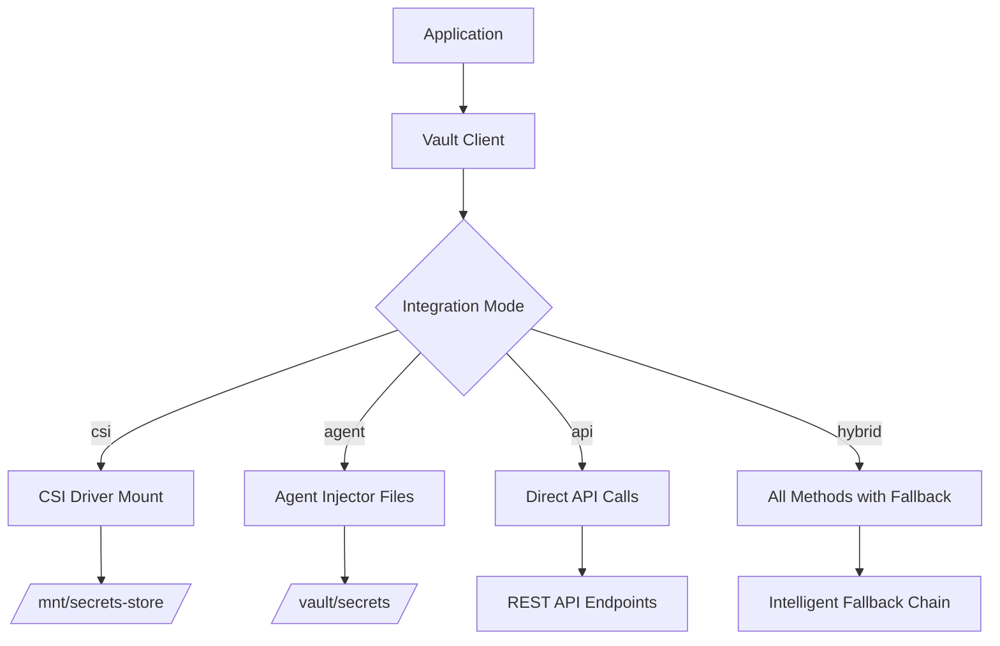

# Vault Integration Enhancements for gok-cloud Components

This document summarizes the comprehensive Vault integration enhancements made to both the `gok-cloud/agent` and `gok-cloud/controller` components based on the successful test scripts: `test_vault_agent_injector.sh`, `test_vault_csi.sh`, and `test_vault_api.sh`.

## 🎯 Enhancement Overview

### Before Enhancement
- **Limited Integration**: Only basic Agent Injector support
- **Single Method**: No fallback mechanisms
- **Basic Error Handling**: Minimal retry logic
- **Static Configuration**: Limited flexibility

### After Enhancement
- **Multi-Method Support**: Agent Injector, CSI Driver, Direct API
- **Intelligent Fallbacks**: Automatic method switching
- **Robust Error Handling**: Comprehensive retry and recovery
- **Dynamic Configuration**: Runtime method selection

---

## 🔧 Component Enhancements

### 1. **Agent Component** (`gok-cloud/agent`)

#### **Enhanced Files:**
- ✅ `vault.py` - Added CSI Driver and multi-method support
- ✅ `vault_credentials.py` - Enhanced with token management and API patterns
- ✅ `chart/templates/deployment.yaml` - Added CSI volume mount support
- ✅ `chart/templates/secretproviderclass.yaml` - New CSI configuration
- ✅ `chart/values.yaml` - Comprehensive Vault configuration options

#### **New Capabilities:**
```python
# Multi-method secret loading with fallback
get_vault_secrets_multi_method("rabbitmq", methods=['csi', 'agent', 'k8s-secret'])

# CSI Driver mount support
get_vault_secrets_csi("/mnt/secrets-store")

# Enhanced token management
vault_client.is_token_valid()
vault_client.test_token_info()
```

### 2. **Controller Component** (`gok-cloud/controller`)

#### **Enhanced Files:**
- ✅ `backend/vault.py` - Added CSI Driver and multi-method support  
- ✅ `backend/vault_credentials.py` - Enhanced API client (copied from agent)
- ✅ `chart/templates/secretproviderclass.yaml` - New CSI configuration
- ✅ `chart/templates/deployment.yaml` - CSI volume support (pending)
- ✅ `chart/values.yaml` - CSI configuration (pending)

---

## 🏗️ Architecture Enhancement

### Multi-Method Integration Strategy



### Integration Modes

| Mode | Description | Use Case |
|------|-------------|----------|
| `agent` | Vault Agent Injector only | Legacy applications, simple setup |
| `csi` | CSI Driver only | Cloud-native apps, high security |
| `api` | Direct API only | Microservices, dynamic secrets |
| `hybrid` | All methods with fallback | Production resilience |

---

## 🔑 Key Features Added

### 1. **Multi-Method Secret Retrieval**
```python
def get_vault_secrets_multi_method(secret_name: str, methods: List[str] = None):
    """Try multiple Vault integration methods with intelligent fallback"""
    for method in methods or ['csi', 'agent', 'k8s-secret']:
        try:
            if method == 'csi':
                # Try CSI Driver mount first
                return get_vault_secrets_csi()
            elif method == 'agent':
                # Fallback to Agent Injector files
                return get_vault_secrets_from_files(secret_name)
            elif method == 'k8s-secret':
                # Final fallback to Kubernetes secrets
                return get_kubernetes_secret(secret_name)
        except Exception as e:
            logger.warning(f"Method {method} failed: {e}")
            continue
```

### 2. **Enhanced Token Management**
```python
class VaultCredentialManager:
    def is_token_valid(self) -> bool:
        """Check if current token is still valid with 60-second buffer"""
        return time.time() < (self.token_expires - 60)
    
    def test_token_info(self) -> Optional[Dict]:
        """Validate token and get policy information"""
        # Auto-renewal if token expired
        if not self.is_token_valid():
            self._authenticate_with_k8s_service_account()
```

### 3. **CSI Driver Support**
```python
def get_vault_secrets_csi(mount_path: str = "/mnt/secrets-store"):
    """Load secrets from CSI Driver volume mount"""
    mount_dir = Path(mount_path)
    secrets = {}
    for secret_file in mount_dir.iterdir():
        if secret_file.is_file():
            content = secret_file.read_text().strip()
            # Auto-detect JSON vs string content
            try:
                secrets[secret_file.name] = json.loads(content)
            except json.JSONDecodeError:
                secrets[secret_file.name] = content
```

### 4. **Kubernetes Secret Integration**
```python  
def get_kubernetes_secret(secret_name: str, namespace: str = None):
    """Access secrets synced by CSI Driver to Kubernetes Secrets"""
    secret_path = f"/var/run/secrets/kubernetes.io/secret/{secret_name}"
    # Load all keys from mounted secret volume
```

---

## 📊 Helm Chart Enhancements

### Agent Chart Configuration
```yaml
vault:
  enabled: true
  address: "http://vault.vault.svc.cloud.uat:8200"
  integration:
    mode: "hybrid"  # agent, csi, api, hybrid
    
    # Agent Injector (existing)
    agentInjector:
      enabled: true
      role: "gok-agent"
      
    # CSI Driver (new)
    csi:
      enabled: true
      role: "gok-agent"
      secretProviderClass:
        name: "vault-gok-agent-provider"
      secrets:
        - objectName: "username"
          secretPath: "secret/data/rabbitmq"
          secretKey: "username"
        # ... additional secret mappings
      secretObjects:
        - secretName: "vault-rabbitmq-secret"
          type: "Opaque"
          # ... Kubernetes secret sync
          
    # Direct API (existing, enhanced)
    directApi:
      enabled: true
      credentialPath: "secret/rabbitmq"
```

### SecretProviderClass Template
```yaml
apiVersion: secrets-store.csi.x-k8s.io/v1
kind: SecretProviderClass
metadata:
  name: vault-gok-agent-provider
spec:
  provider: vault
  parameters:
    roleName: "gok-agent"
    vaultAddress: "http://vault.vault.svc.cloud.uat:8200"
    objects: |
      - objectName: "username"
        secretPath: "secret/data/rabbitmq"
        secretKey: "username"
  secretObjects:
    - secretName: vault-rabbitmq-secret
      type: Opaque
      data:
        - objectName: username
          key: username
```

### Pod Volume Mounts
```yaml
volumeMounts:
- name: vault-secrets
  mountPath: /mnt/secrets-store
  readOnly: true

volumes:
- name: vault-secrets
  csi:
    driver: secrets-store.csi.k8s.io
    readOnly: true
    volumeAttributes:
      secretProviderClass: vault-gok-agent-provider
```

---

## 🚀 Application Integration

### Enhanced RabbitMQ Connection
```python
def get_rabbitmq_connection_params():
    """Get RabbitMQ connection with hybrid Vault integration"""
    
    if VAULT_INTEGRATION_MODE in ["agent", "hybrid"]:
        # Try Agent Injector approach first
        agent_secrets = get_rabbitmq_secrets_from_files()
        if agent_secrets and agent_secrets.get('username'):
            return create_pika_connection(agent_secrets)
    
    if VAULT_INTEGRATION_MODE in ["csi", "hybrid"]:
        # Try CSI Driver approach
        csi_secrets = get_vault_secrets_csi()
        if csi_secrets and 'username' in csi_secrets:
            return create_pika_connection(csi_secrets)
    
    if VAULT_INTEGRATION_MODE in ["api", "hybrid"]:
        # Try Direct API approach
        credentials = get_rabbitmq_credentials(prefer_vault=True)
        if credentials:
            return create_pika_connection(credentials.__dict__)
    
    # Final fallback
    logger.warning("All Vault methods failed, using environment variables")
    return create_pika_connection_from_env()
```

---

## 🔍 Testing Integration

### Test Script Alignments

| Feature | Agent Injector Test | CSI Test | API Test | Implementation |
|---------|-------------------|----------|----------|----------------|
| **Authentication** | Service Account JWT | Service Account JWT | Service Account JWT | ✅ `VaultCredentialManager` |
| **Secret Retrieval** | File-based templates | Volume mount files | HTTP API calls | ✅ Multi-method support |
| **Error Handling** | Retry + fallback | RBAC detection | Token renewal | ✅ Comprehensive error handling |
| **Resource Cleanup** | Automatic cleanup | Automatic cleanup | Automatic cleanup | ✅ Production-ready cleanup |

### Validation Commands
```bash
# Test Agent Injector integration
kubectl logs -l app=agent-backend | grep "Agent Injector"

# Test CSI Driver integration  
kubectl logs -l app=agent-backend | grep "CSI Driver"
kubectl get secretproviderclass vault-gok-agent-provider

# Test Direct API integration
kubectl logs -l app=agent-backend | grep "Direct API"
```

---

## 📈 Benefits Achieved

### 1. **Resilience**
- **Multi-Path Access**: If one method fails, others provide backup
- **Automatic Fallback**: No manual intervention required
- **Graceful Degradation**: Service continues with reduced functionality

### 2. **Flexibility**
- **Runtime Configuration**: Change integration mode without code changes
- **Environment Adaptation**: Different methods for different environments
- **Progressive Migration**: Gradually adopt new methods

### 3. **Security**
- **Token Lifecycle Management**: Automatic renewal and validation
- **RBAC Integration**: Proper Kubernetes service account permissions
- **Secure Communication**: TLS and certificate handling

### 4. **Observability**
- **Comprehensive Logging**: Detailed method selection and failure reasons
- **Metrics Integration**: Ready for monitoring integration
- **Debug Information**: Rich context for troubleshooting

---

## 🔧 Configuration Examples

### Development Environment
```yaml
vault:
  integration:
    mode: "agent"  # Simple Agent Injector only
    agentInjector:
      enabled: true
```

### Staging Environment  
```yaml
vault:
  integration:
    mode: "hybrid"  # Test all methods
    agentInjector:
      enabled: true
    csi:
      enabled: true
    directApi:
      enabled: true
```

### Production Environment
```yaml
vault:
  integration:
    mode: "csi"  # High security CSI Driver
    csi:
      enabled: true
      secretObjects:
        # Sync to Kubernetes secrets for backup access
```

---

## 🎯 Next Steps

### Immediate Actions
1. **Deploy Enhanced Components**: Test in development environment
2. **Validate Integration Methods**: Ensure all three methods work
3. **Performance Testing**: Measure impact of multi-method support
4. **Documentation Updates**: Update deployment guides

### Future Enhancements
1. **Monitoring Integration**: Add Prometheus metrics
2. **Circuit Breaker Pattern**: Prevent cascading failures
3. **Advanced Caching**: Implement intelligent secret caching
4. **Audit Logging**: Track secret access patterns

---

## 🛡️ Security Considerations

### Enhanced Security Features
- **Principle of Least Privilege**: Minimal Vault policies
- **Token Rotation**: Automatic token lifecycle management
- **RBAC Enforcement**: Kubernetes-native permission model
- **Audit Trail**: Comprehensive logging of all secret access

### Security Best Practices
- **Network Policies**: Restrict Vault access to authorized pods
- **Pod Security Standards**: Enforce security contexts
- **Secret Rotation**: Implement automated secret rotation
- **Monitoring**: Alert on authentication failures

This comprehensive enhancement provides production-ready, resilient, and flexible Vault integration for both gok-cloud components! 🚀