# Information

## Installation

Note: [`Ingress Controller`](../ingress/README.md) should be installed if dashboard need to be accessible from outside the cluster.

### Gok
```console
./gok install keycloak
./gok create certificate keycloak keycloak
./gok patch ingress keycloak keycloak letsencrypt keycloak
```
### Gok Alternate
```console
gok install keycloak
```

### Uninstall
```console
./gok reset keycloak
```

## Postgresql
```console
kubectl exec -it keycloak-postgresql-0 -- /bin/bash
psql -U sumit_keycloak -d bitnami_keycloak
```

```sql
SELECT * FROM pg_catalog.pg_tables;
SELECT * FROM user_entity;
SELECT * FROM credential;
```

## Keycloak

**Admin console**
1. Url: https://keycloak.gokcloud.com/
2. Username: admin
3. Password: admin

**User Console**
1. Url: https://keycloak.gokcloud.com/realms/{realm_name}/account

## Automation to create Realm, Client, Scope, Group, User

- Install python
```console
apt-get install python3
apt-get install python3-pip
pip3 install -r requirements-cli.txt
```
- Install Keycloak objects
```commandline
cd ${MOUNT_PATH}/kubernetes/install_k8s/keycloak
python3 keycloak-client.py all
```

## Adding a new Realm
1. Click on `Create Realm`

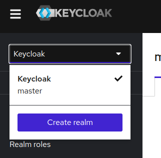

2. Fill details and click on create

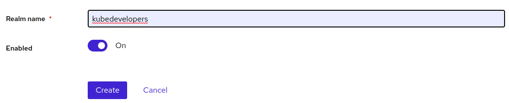

3. Realm create

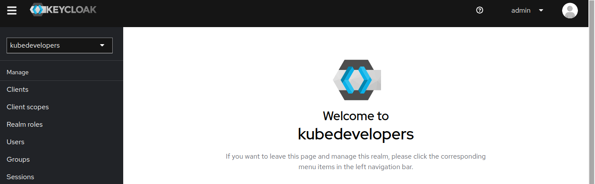

## Add user in realm

1. Select the realm

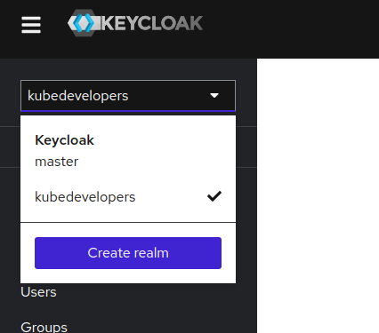

2. Click on Users

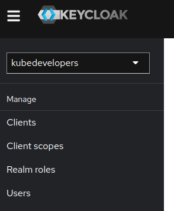

3. Click on `Create New User`

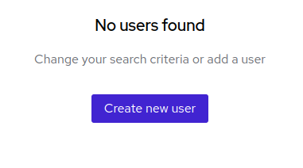

4. Fill the details and click on `Create` button

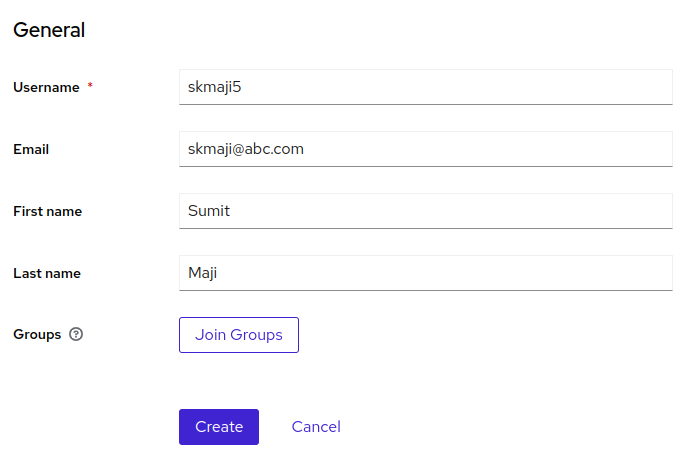

5. Setup credential for the user

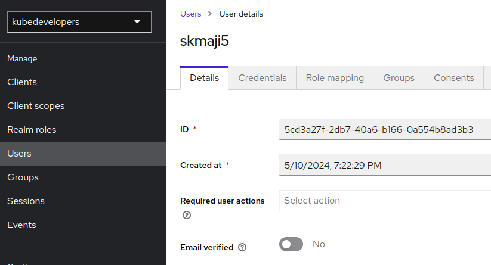

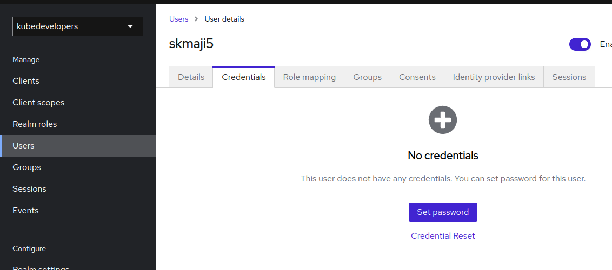

## User Login

1. Open link https://keycloak.gokcloud.com/realms/kubedevelopers/account
2. Add username and password to login

## Create a new OAuth Client Application

1. Select realm and click on `Create Client`

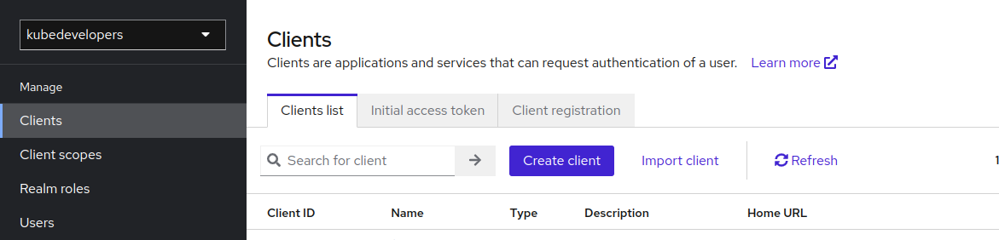

2. Fill the details and save

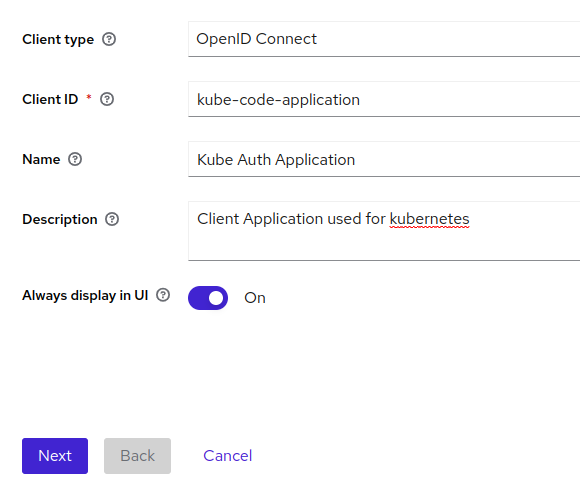

3. Fill redirect url

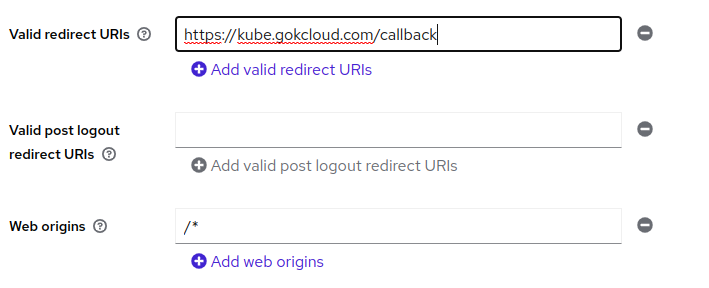

4. Standard flow should be enabled for Code Grant type authentication and click on save

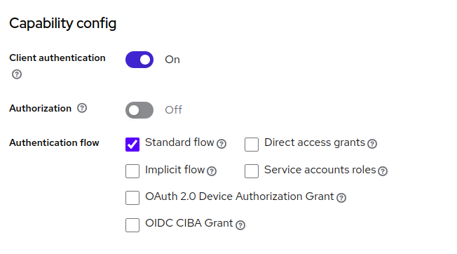

5. Click credentials tab to get cliet id and client secrets.

## Test Code Grant Authorization

1. Open Browser and put the below url

https://keycloak.gokcloud.com/realms/kubedevelopers/protocol/openid-connect/auth?client_id=kube-code-client&response_type=code&scope=openid profile&redirect_uri=https://kube.gokcloud.com/callback&state=asdfasdau

2. As a response you will receive code

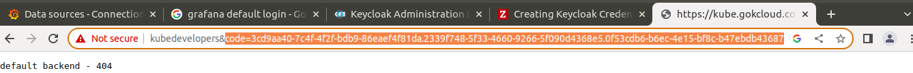

3. Put the code in below url and send post request x-www-form-urlencoded

https://keycloak.gokcloud.com/realms/kubedevelopers/protocol/openid-connect/token

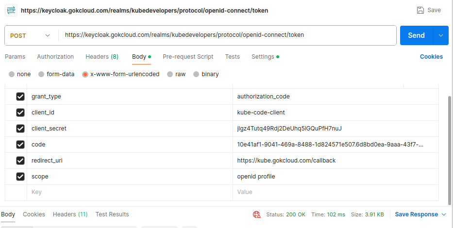