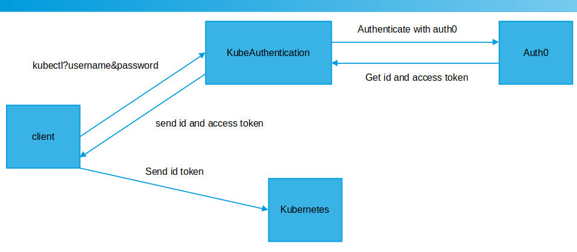

# Kube Token based login cli

`.env` file contains details about `CLIENT_ID`, `ISSUER` and `APP_HOST`.

# Installation steps

- Install python
```console
apt-get install python3
apt-get install python3-pip
pip3 install -r requirements-cli.txt
```

- Create kubeconfig file containing details about server
```console
kubectl config set-cluster cloud.com --certificate-authority=/etc/kubernetes/pki/ca.crt --embed-certs=true --server=https://${SERVER_HOST:PORT} --kubeconfig=/root/oauth.conf
kubectl config --kubeconfig=/root/oauth.conf set-context oauthuser@cloud.com --cluster=cloud.com --user=oauthuser
kubectl config --kubeconfig=/root/oauth.conf use-context oauthuser@cloud.com
```

- Create alias that would use cli to fetch token
```console
alias kctl='kubectl --kubeconfig=/root/oauth.conf --token=$(python3 /root/kubernetes/install_k8s/kube-login/cli-auth.py)'
kctl get po
```

- Sample login
skmajiadmin@outlook.com - admin access
skmaji2@outlook.com - developer access

The Roles are created in [`install-k8s.sh`](https://github.com/sumitmaji/kubernetes/blob/master/install_k8s/install-k8s.sh#L153)

# Architecture


