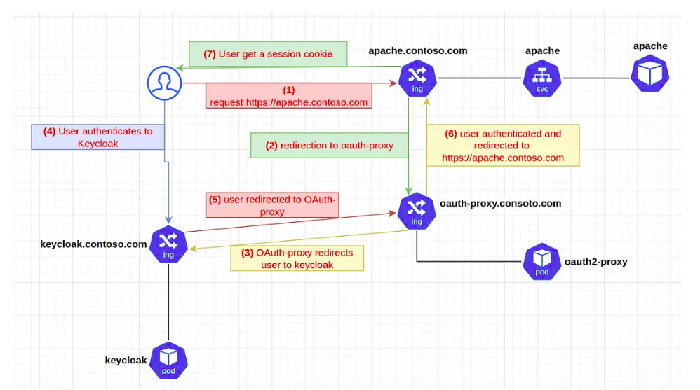

# Oauth2 Proxy

## Authentication workflow

1. The user try to access to https://apache.contoso.com
2. The nginx ingress check if the user already authenticated to the OAuth2 Proxy.
3. The user is not yet authenticated, so OAuth2 Proxy redirect the user to Keycloak
4. User authenticates to Keycloak
5. Keycloak redirects user to OAuth2 Proxy
6. Oauth2 Proxy redirects user to https://apache.contoso.com
7. The user receive a session cookie which will enable him to authenticate for future requests

## Documentation
https://oauth2-proxy.github.io/oauth2-proxy/configuration/providers/keycloak
https://oauth2-proxy.github.io/oauth2-proxy/installation
https://docs.syseleven.de/metakube/de/tutorials/setup-ingress-auth-to-use-keycloak-oauth