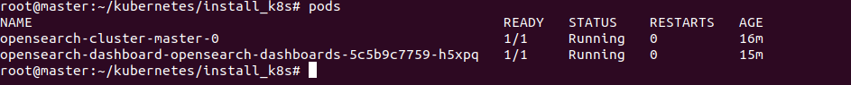
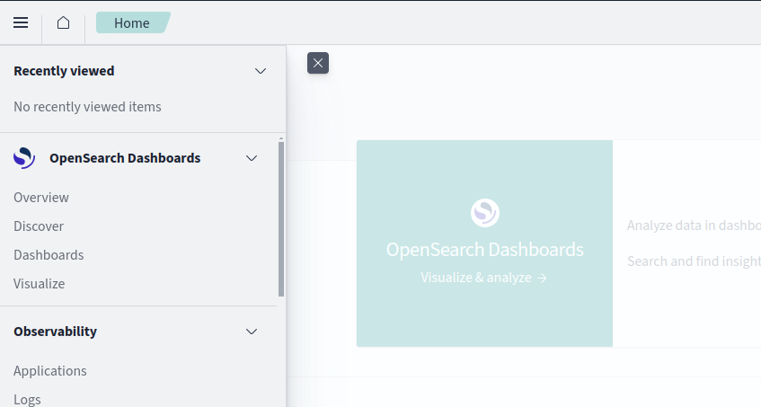
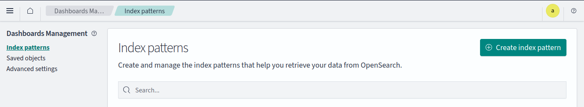
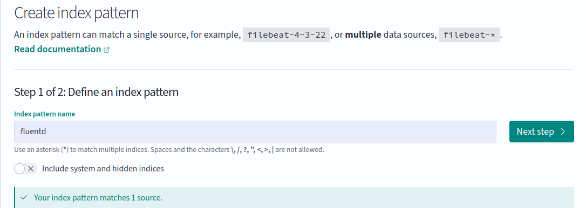
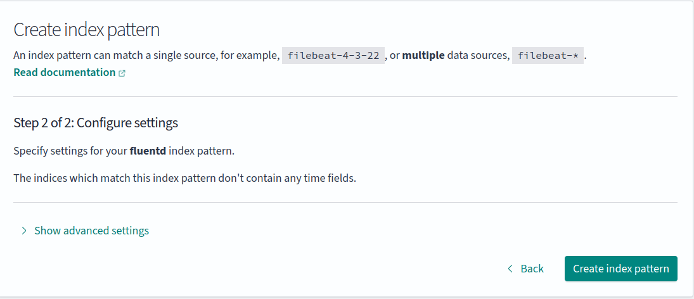
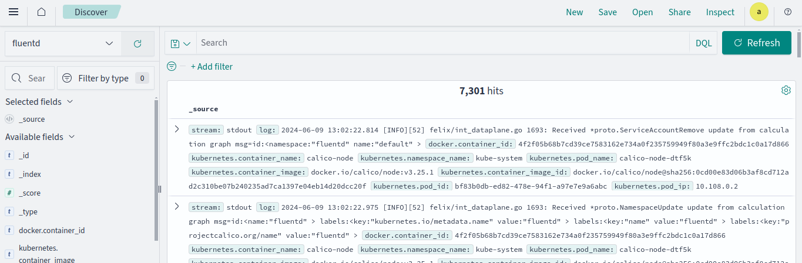

# Opensearch

## Documentation
- [Opensearch](https://opensearch.org/docs/latest/install-and-configure/install-opensearch/helm/)
- [Opensearch Dashboard](https://artifacthub.io/packages/helm/opensearch-project-helm-charts/opensearch-dashboards)

## Install

```shell
./gok install opensearch
```



## Uninstall

```shell
./gok reset opensearch
```

## Setup

**Note:** Before beginning setup, make sure [fluentd](../fluentd/README.md) service has been started.

- Switch tenant as Admin
- Click on `Discover`



- Click on `Create Index Pattern`



- Filter the `fluentd` index and click on next



- Click on create index pattern



- Select `Discover` again, you should be able to view container logs under fluentd index.

