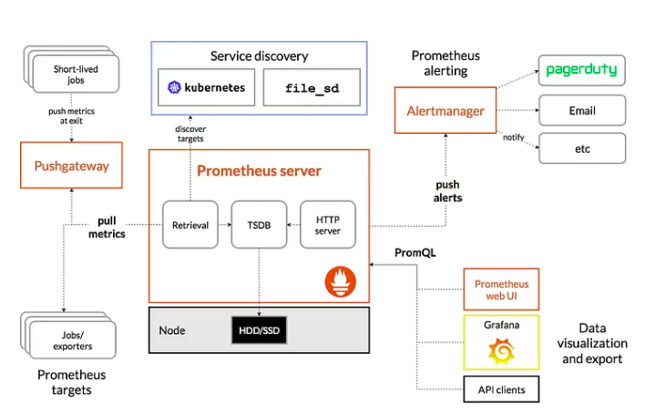

# Prometheus and Grafana

### Installing prometheus and grafana
- Helm
https://www.youtube.com/watch?v=bwUECsVDbMA

- Kubectl
https://www.youtube.com/watch?v=mtE4migphGE

[Learn](https://k21academy.com/docker-kubernetes/prometheus-grafana-monitoring/)

Architecture Diagram

**Prometheus Server:** The main server which stores and scrapes time series data.

**TSDB(Time Series Database):** Metrics are a critical aspect of any system to understand its health and operational state. Design of any system requires collection, storage and reporting of metrics to provide a pulse of the system. Data is stored over a series of time intervals and needs an efficient database to store and retrieve this data.OpenTSDB Time Series Database is one such time series database that can serve that need.

**PromQL:** Prometheus defines a rich query language in the form of PromQL to query data from the time series database.

**Pushgateway:** Available to support short lived jobs.

**Exporters:** They are used to promoting metrics data to the prometheus server.

**Alertmanager:** Used to send notifications to various communication channels like slack, email to notify users.